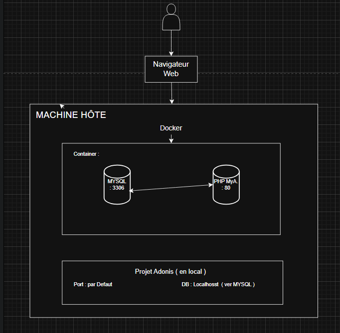
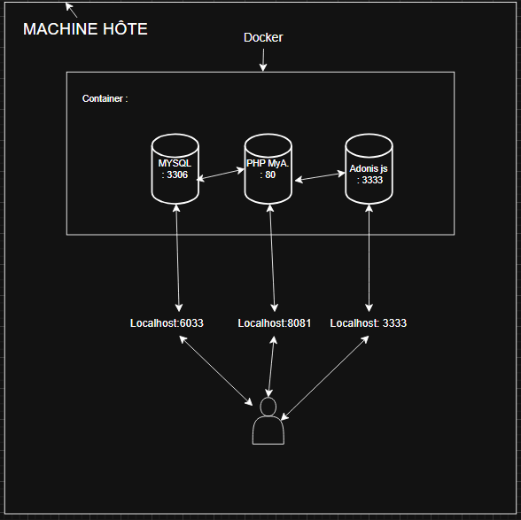
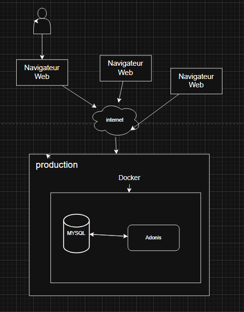
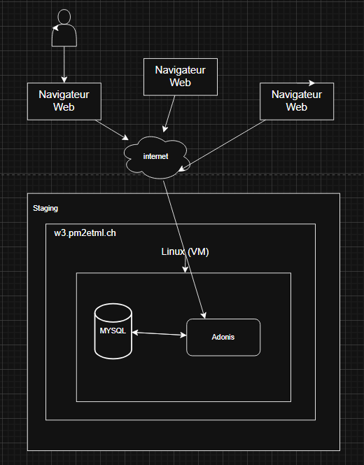

# Flash-Card Application - Romain Schertenleib

## 📚 Description du Projet

### Partie 1
Création de l'application Flash Card depuis le début. L'application Flash-Card est une application qui permet d'apprendre interactivement des questions avec leurs réponses.

### Partie 2
Finalisation des fonctionnalités de l'application Flash-Card, puis dockerisation de l'application et mise en production.

---

## 🛠️ Logiciels Requis

L'application utilise :

- **Node.js** : `v22.13.1`
- **npm** : `10.9.2`
- **Docker** pour les services :
  - MySQL
  - phpMyAdmin
  - Node.js

---

## 🚀 Lancer l'Application

### 1. Cloner le Repository

```bash
git clone https://github.com/romainschert/FlashCards.git
cd ./FlashCards/app-Flash-Card-adonisjs
```

### 2. Configuration de l'Environnement

Renommer `.env.example` en `.env` et ajouter les variables d'environnement :

```env
TZ=UTC
PORT=3333
HOST=localhost
LOG_LEVEL=info
APP_KEY=
NODE_ENV=development
SESSION_DRIVER=cookie
DB_HOST=127.0.0.1
DB_PORT=6034
DB_USER=root
DB_PASSWORD=root
DB_DATABASE=app_adonis
```

> ⚠️ **Important** : Il est crucial que les variables d'environnement soient correctes pour que le projet puisse démarrer.

### 3. Installation des Dépendances

```bash
npm install
```

### 4. Génération de la Clé d'Application

```bash
node ace generate:key
npm run dev
```

---

## 🐳 Démarrer les Containers Docker

Dans la racine du projet, où se trouve le fichier `docker-compose.yml`, ouvrir un terminal et exécuter :

```bash
docker compose up -d
```

Une fois cette commande exécutée, trois containers seront créés :

1. **MySQL** - Base de données
2. **phpMyAdmin** - Interface d'administration de la base de données
3. **Application dockerisée** - L'application Flash-Card

---

## 💻 Application en Mode Développement

Aller à la racine du projet et lancer la commande :

```bash
npm run dev
```

L'application sera disponible sur : **http://localhost:3333/**

### Schéma de l'Architecture


---

## 🐋 Dockerisation

Description des étapes nécessaires pour dockeriser une application AdonisJS avec une base de données MySQL, les migrations, les seeds, et un accès via le navigateur.

### Prérequis
- Docker et Docker Compose installés
- Un projet AdonisJS existant (node ace fonctionne)
- Une base MySQL utilisée par le projet
- Fichier `.env` configuré

### Étape 1 : Dockerfile

```dockerfile
FROM node:20.11.1-alpine3.19

# Création du répertoire de travail
WORKDIR /app

# Copie des fichiers de configuration
COPY package.json ./

# Copie du code source
COPY . .

RUN rm -rf ./node_modules
RUN rm -rf ./package-lock.json

# Installation des dépendances avec npm directement
RUN npm install

# Copie du script d'entrée avant la construction
COPY docker-entrypoint.sh /usr/local/bin/
RUN chmod +x /usr/local/bin/docker-entrypoint.sh

# Vérifier que le script existe bien et est exécutable
RUN ls -la /usr/local/bin/docker-entrypoint.sh

# Exposition du port
EXPOSE 3333

# Exécuter le script directement avec le chemin complet
ENTRYPOINT ["/usr/local/bin/docker-entrypoint.sh"]
```

### Étape 2 : Script d'Entrée

```bash
#!/bin/sh
set -e

echo "Attente du démarrage de MySQL..."
sleep 10

# Exécuter les migrations
echo "Exécution des migrations..."
node ace migration:run --force

# Exécuter les seeds
echo "Exécution des seeds..."
node ace db:seed

# Build de l'application
echo "Build de l'application..."
npm run build

echo "Copie des ressources..."

# Créer les dossiers de destination (avec -p pour créer les parents)
mkdir -p build/resources/css
mkdir -p build/resources/js

# Copier les fichiers CSS
echo "Copie des fichiers CSS..."
[ -f "./resources/css/app.css" ] && cp "./resources/css/app.css" "./build/resources/css/app.css"
[ -f "./resources/css/decks_created.css" ] && cp "./resources/css/decks_created.css" "./build/resources/css/decks_created.css"
[ -f "./resources/css/flashcard-detail.css" ] && cp "./resources/css/flashcard-detail.css" "./build/resources/css/flashcard-detail.css"
[ -f "./resources/css/flashcards_create.css" ] && cp "./resources/css/flashcards_create.css" "./build/resources/css/flashcards_create.css"
[ -f "./resources/css/flashcards.css" ] && cp "./resources/css/flashcards.css" "./build/resources/css/flashcards.css"
[ -f "./resources/css/home.css" ] && cp "./resources/css/home.css" "./build/resources/css/home.css"
[ -f "./resources/css/login.css" ] && cp "./resources/css/login.css" "./build/resources/css/login.css"
[ -f "./resources/css/register.css" ] && cp "./resources/css/register.css" "./build/resources/css/register.css"
[ -f "./resources/css/decks.css" ] && cp "./resources/css/decks.css" "./build/resources/css/decks.css"

echo "Copie des fichiers JS..."
[ -f "./resources/js/app.js" ] && cp "./resources/js/app.js" "./build/resources/js/app.js"

echo "Installation des dépendances de production..."
npm ci --omit=dev

echo "Démarrage de l'application..."
cd build
exec node bin/server.js
```

### Étape 3 : docker-compose.yml

```yaml
version: '3.3'

services:
  db:
    image: mysql:8.0.30
    container_name: db_flashcards
    environment:
      MYSQL_ROOT_PASSWORD: root
      MYSQL_USER: db_user
      MYSQL_PASSWORD: db_user_pass
    restart: always
    ports:
      - '6033:3306'
    volumes:
      - dbdata:/var/lib/mysql
      - ./scripts:/scripts

  phpmyadmin:
    image: phpmyadmin:5.2.0
    container_name: db_flashcards_pma
    links:
      - db
    environment:
      PMA_HOST: db
      PMA_PORT: 3306
      PMA_ARBITRARY: 1
    restart: always
    ports:
      - 8081:80

  adonis:
    build:
      context: .
      dockerfile: Dockerfile
    container_name: adonis_app
    restart: always
    volumes:
      - .:/app
      - /app/node_modules
    ports:
      - '3333:3333'
    environment:
      TZ: UTC
      PORT: 3333
      HOST: 0.0.0.0
      LOG_LEVEL: info
      APP_KEY:
      NODE_ENV: development
      SESSION_DRIVER: cookie
      DB_CONNECTION: mysql
      DB_HOST: db
      DB_PORT: 3306
      DB_USER: db_user
      DB_PASSWORD: db_user_pass
      DB_DATABASE: db_flashcards
    depends_on:
      - db

volumes:
  dbdata:
```

### Script de Recréation des Containers

Si pendant la dockerisation vous rencontrez des problèmes et que vous les corrigez, utilisez le script `recreate_dockers.sh` pour recréer les containers.

### Schéma Docker


---

## 🌐 Mise en Production

### Render

Pour pouvoir mettre en production votre projet, il faut d'abord créer un compte sur Render.

Pendant la création du compte, il est demandé de donner l'accès à Render sur un repository Git. Là, il faut mettre le repository de l'application à mettre en production.

#### Configuration Render

1. Cliquer sur **"Add New"**
2. Choisir **"Web Service"**
3. Choisir le bon repository Git

#### Settings

1. **Name** : Mettre un nom pour votre service
2. **Branch** : `main`
3. **Root Directory** : `app-Flash-Card-adonisjs`
4. **Dockerfile Path** : `app-Flash-Card-adonisjs/./Dockerfile`
5. **Instance Type** : Choisir l'instance Free
6. **Docker Build Context Directory** : `app-Flash-Card-adonisjs/.`

#### Variables d'Environnement

```env
TZ=UTC
PORT=3333
HOST=localhost
LOG_LEVEL=info
APP_KEY=
NODE_ENV=development
SESSION_DRIVER=cookie
DB_HOST=(propre à la database)
DB_PORT=(propre à la database)
DB_USER=root
DB_PASSWORD=(propre à la database)
DB_DATABASE=db_adonis
```

### Configuration de la Base de Données

1. **Add New** → **PostgreSQL**

#### Settings Database

- **Name** : `postgres-Flash-card`
- **Database Name** : `db_adonis`
- **User** : `root`
- **Plan** : Free

2. Récupérer les informations de la base de données en cliquant dessus et mettre ces informations dans les variables d'environnement.

### Lancement de la Production

Retourner sur la production et lancer **"Manual Deploy"** sur le dernier commit.

Et voilà ! Votre application est déployée ! 🎉

---

## ⚠️ Erreurs Rencontrées

Le déploiement fonctionne, mais il y a une erreur qui revient en boucle malgré les tentatives pour la corriger (tentatives visibles sur GitHub).

**Erreur :**
```json
{
  "level": 50,
  "time": 1748431461460,
  "pid": 41,
  "hostname": "srv-d0djqqidbo4c738kmbj0-hibernate-5b645545f9-dv8kw",
  "request_id": "pw0og40a1v494bsdjnu0r3yh",
  "err": {
    "type": "EdgeError",
    "message": "Cannot resolve \"/app/build/resources/views/partials/header.edge\". Make sure the file exists",
    "stack": "Error: Cannot resolve \"/app/build/resources/views/partials/header.edge\". Make sure the file exists...",
    "line": 13,
    "col": 0,
    "filename": "/app/build/resources/views/home.edge",
    "code": "E_RUNTIME_EXCEPTION",
    "status": 500
  },
  "msg": "Cannot resolve \"/app/build/resources/views/partials/header.edge\". Make sure the file exists"
}
```

### Schéma de Production


---

## 🧪 Staging (sur Railway car pas possible sur Render)

> **Note :** Je n'ai pas fait la partie staging, mais voici ce que j'aurais fait :

Le staging est un environnement intermédiaire entre le développement et la production qui permet de tester l'application dans des conditions similaires à la production avant le déploiement final.

### Architecture de Staging

#### Structure des Environnements

```
├── Development (local)
├── Staging (test)        ← Nous sommes ici
└── Production (live)
```

#### Configuration Staging

**Variables d'environnement pour staging (`.env.staging`)** :

```env
# Application
APP_KEY=your-staging-app-key-here
NODE_ENV=staging
HOST=0.0.0.0
PORT=3333
LOG_LEVEL=debug

# Base de données de staging
DB_HOST=staging-db-host
DB_PORT=3306
DB_USER=staging_user
DB_PASSWORD=staging_secure_password
DB_DATABASE=flashcards_staging

# Sessions et sécurité
SESSION_DRIVER=cookie
```

### Déploiement sur Railway (Staging)

#### 1. Création du Service Staging

```bash
# Créer une nouvelle branche staging
git checkout -b staging
git push origin staging
```

#### 2. Base de Données Staging Séparée

```bash
# Créer un service MySQL dédié au staging
# Variables à configurer dans Railway :
MYSQL_DATABASE=flashcards_staging
MYSQL_USER=staging_user
MYSQL_PASSWORD=secure_staging_password
```

#### 3. Scripts de Déploiement Staging

**package.json** - Ajouter les scripts suivants :

```json
{
  "scripts": {
    "staging:build": "npm run build",
    "staging:migrate": "node ace migration:run --force",
    "staging:seed": "node ace db:seed --force",
    "staging:deploy": "npm run staging:migrate && npm run staging:seed && npm start",
    "staging:rollback": "node ace migration:rollback --force",
    "staging:reset": "node ace migration:fresh --seed --force"
  }
}
```

### Tests Automatisés en Staging

#### 1. Tests d'Intégration

Créer un fichier `tests/staging/integration.spec.ts` :

```typescript
import { test } from '@japa/runner'
import { BaseSeeder } from '@adonisjs/lucid/seeders'

test.group('Staging Integration Tests', () => {
  test('should connect to staging database', async ({ assert }) => {
    // Test de connexion à la base de données
    const Database = (await import('@adonisjs/lucid/database')).default
    const connection = await Database.connection()
    assert.isTrue(connection.isConnected)
  })

  test('should run migrations successfully', async ({ assert }) => {
    // Test des migrations
    const { default: Migrator } = await import('@adonisjs/lucid/migrator')
    const migrator = new Migrator(Database, Application, {
      direction: 'up',
      dryRun: false,
    })
    await migrator.run()
    assert.isTrue(migrator.status === 'completed')
  })

  test('should seed data successfully', async ({ assert }) => {
    // Test des seeders
    // Vérifier que les données de test sont bien créées
    const User = (await import('#models/user')).default
    const users = await User.all()
    assert.isTrue(users.length > 0)
  })
})
```

#### 2. Tests de Performance

```typescript
test.group('Performance Tests', () => {
  test('should handle multiple concurrent users', async ({ assert }) => {
    // Simuler 100 requêtes simultanées
    const promises = Array(100).fill(null).map(() => 
      fetch('https://flashcards-staging.yourdomain.com/api/health')
    )
    
    const results = await Promise.all(promises)
    const successfulRequests = results.filter(r => r.status === 200)
    
    assert.isTrue(successfulRequests.length >= 95) // 95% de succès minimum
  })
})
```

### Processus de Validation Staging

#### 1. Checklist de Déploiement

- [ ] **Code review** terminé et approuvé
- [ ] **Tests unitaires** passent (100%)
- [ ] **Tests d'intégration** passent
- [ ] **Migrations** testées et validées
- [ ] **Variables d'environnement** configurées
- [ ] **Base de données staging** opérationnelle
- [ ] **Monitoring** et logs activés

#### 2. Tests Fonctionnels

**Tests Utilisateur :**
- [ ] Inscription/Connexion utilisateur
- [ ] Création de flashcards
- [ ] Modification de flashcards
- [ ] Suppression de flashcards
- [ ] Navigation entre les cartes
- [ ] Système de révision
- [ ] Sauvegarde des progrès

**Tests de Sécurité :**
- [ ] Authentification
- [ ] Autorisation
- [ ] Protection CSRF
- [ ] Validation des données
- [ ] Sécurité des sessions

#### 3. Tests de Charge

```bash
# Utilisation d'Artillery pour les tests de charge
npm install -g artillery

# Créer artillery-staging.yml
artillery run artillery-staging.yml
```

**artillery-staging.yml** :

```yaml
config:
  target: 'https://flashcards-staging.yourdomain.com'
  phases:
    - duration: 60
      arrivalRate: 10
    - duration: 120
      arrivalRate: 50
  defaults:
    headers:
      Content-Type: 'application/json'

scenarios:
  - name: "Load test flashcards"
    requests:
      - get:
          url: "/"
      - get:
          url: "/flashcards"
      - post:
          url: "/api/flashcards"
          json:
            title: "Test Card"
            front: "Question"
            back: "Answer"
```

### Monitoring et Observabilité

#### 1. Logs Structurés

```typescript
// config/logger.ts - Configuration pour staging
import { defineConfig } from '@adonisjs/logger'

export default defineConfig({
  default: 'app',
  loggers: {
    app: {
      enabled: true,
      name: 'flashcards-staging',
      level: 'debug',
      transport: {
        targets: [
          {
            target: 'pino-pretty',
            level: 'info',
            options: {
              colorize: true
            }
          },
          {
            target: 'pino/file',
            level: 'error',
            options: {
              destination: './storage/logs/staging-errors.log'
            }
          }
        ]
      }
    }
  }
})
```

#### 2. Health Checks

```typescript
// app/controllers/health_controller.ts
export default class HealthController {
  async check({ response }: HttpContext) {
    const health = {
      status: 'healthy',
      timestamp: new Date().toISOString(),
      environment: 'staging',
      database: await this.checkDatabase(),
      memory: process.memoryUsage(),
      uptime: process.uptime()
    }
    
    return response.ok(health)
  }
  
  private async checkDatabase() {
    try {
      await Database.rawQuery('SELECT 1')
      return { status: 'connected' }
    } catch (error) {
      return { status: 'error', message: error.message }
    }
  }
}
```
## schema 


## 📝 Conclusion

Ce projet présente une application Flash-Card complète avec :
- ✅ Développement local
- ✅ Dockerisation
- ✅ Mise en production sur Render
- 📋 Plan de staging (conceptuel)

Les principales améliorations apportées concernent la correction orthographique, la structuration du contenu avec des sections claires, l'ajout d'émojis pour une meilleure lisibilité, et l'amélioration de la présentation générale du document.
